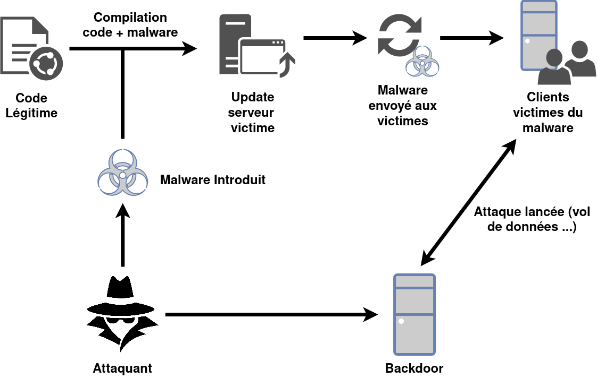

# SolarWinds

## Cyberattaque dirigée contre les USA

Le piratage Solarwinds a ciblé le gouvernerment Américain, ses agences fédérales et des entreprises privés.

Les pirates informatiques aurait d'abord attaqué FireEye

Puis se serait tourné vers Orion un logiciel fourni par la société texane SolarWinds

Récement Microsoft et FireEye ont identifiées 3 nouvelles pieces du malware utilisé par les pirates lors du vaste piratage de SolarWinds l'année dernière

SolarWinds c'est fait pirater, ce piratage est passé inapercue pendant plusieurs mois. Ce piratage aurait permis d'espionner des entreprises privées comme FireEye (grosse societe de Cybersécurité), les échelons supérieurs du gouvernement américain, notamment la sécurité intérieur et ministère du trésor

## Comment ça marche 
Au début de 2020, les pirates ont pénétrés dans le SI de SolarWinds au Texas, et ont ajouté leur malware dans le logiciel appel& ***Orion***. Ce dernier est utilisé par plus de 33 000 clients ((selon les documents de la SEC) pour gérer leur ressources informatiques.

Les fournisseurs de logiciel envoi régulièrement des patch de mise a jour de leurs systemes (pour corriger des bugs, ajouter des fonctionnalités et corriger une faille de sécurité par exemple). SolarWinds ne déroge pas à la règles. En Mars dernier SolarWinds a involontairement envoyé un patch de mise à jour pour leur logiciel contenant le code malveillant.

Ce dernier a crée une backdoor (porte dérobée) vers les SI des clients de SolarWinds. Au final les pirates ont pu installer encore plus de logiciel malveillant afin d'espionner les entrperises ainsi que les organisations.

&nbsp;

## Les victimes

(Selon SolarWinds à la SEC)

Jusqu'à 18.000 des clients de Solarwinds auraient installé la mise à jour comportant le virus malveillant.
Que ce soit des entreprises privées, ou des agences du gouvernement Américain.

Le piratage a été effectué de manière si discrète que plusieurs victimes ne pourront seront jamais si elles ont été impactés par le piratage.

Les pirates auraient réussi à accéder aux comptes de messagerie et dans le réseau où se trouve "les plus hauts responsable du département" mais selon l'IRS aucune preuve de compromission aurait été trouvé et que les pirates n'auraieu accès qu'a des dossiers non classifiés.

&nbsp; 

## Qui est à l'origine de ce piratage ? 

D'après les enquêteurs fédéraux et les experts en cybersécurité, le service de Renseignement Extérieur Russe (aussi connu sous le nom de SVR) serait à l'origine de l'attaque.

La Russie a nié toute implication dans la brèche.

M.Smith de Microsoft à déclaré qu'il pensait que le Russie était àl'origine de l'attaque. Et Kevin Mandia, PDG de FireEye à déclaré sur la base de l'analyse médico-légale de sa société que l'espionnage et les comportements se raprocher de la manière de faire des Russes.

&nbsp;

## Pourquoi c'est important ?

